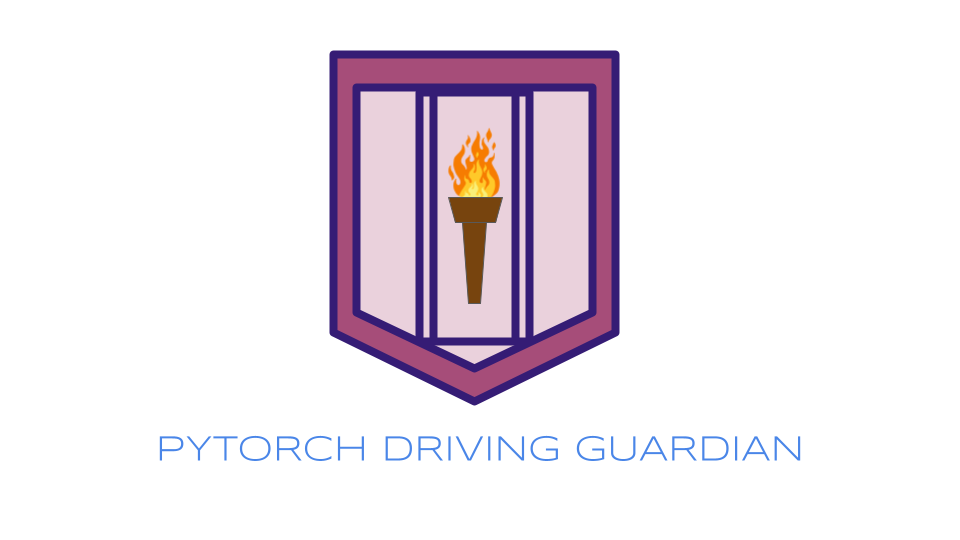
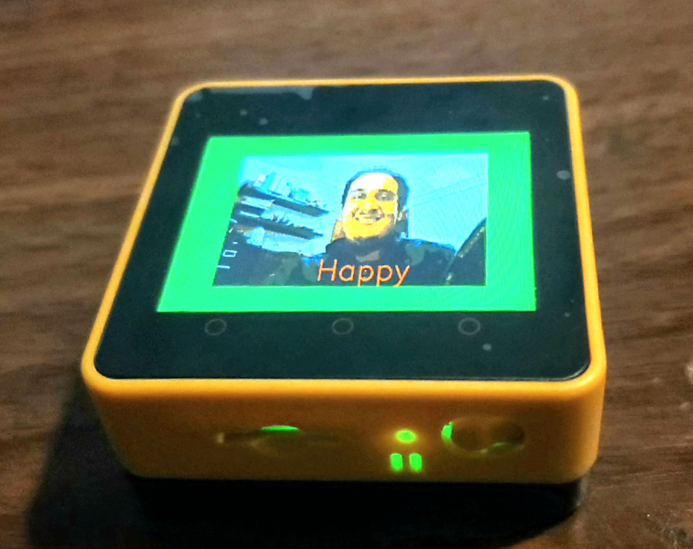
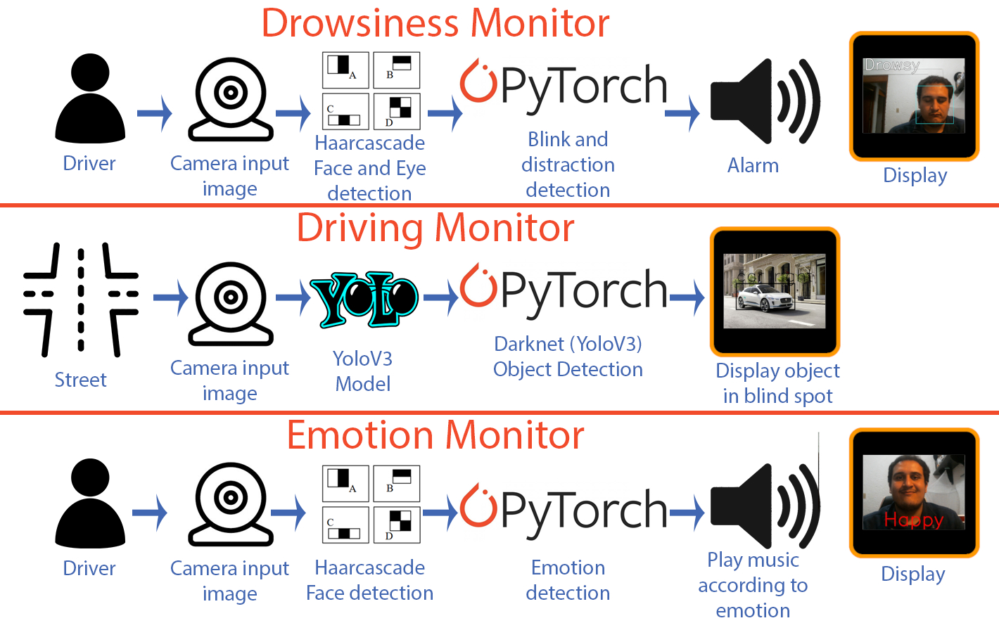
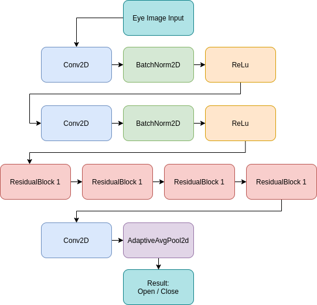
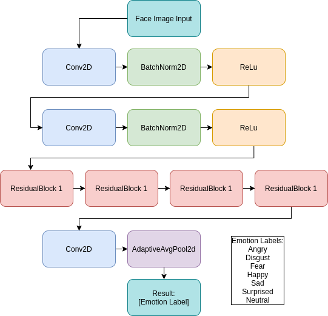

# Pytorch Driving Guardian

Comprehensive monitor of driver alertness, emotional state and intelligent car blind spot checker.

### Hi!, if you are a judge and want to review the models running in GoogleColab here are the notebooks.

[Drowsiness](https://github.com/altaga/Pytorch-Driving-Guardian/blob/main/Hardware%20Code/Jetson%20Code/Drowsiness/Drowsiness.ipynb)

[Emotions](https://github.com/altaga/Pytorch-Driving-Guardian/blob/main/Hardware%20Code/Jetson%20Code/Emotion%20detection/Emotion.ipynb)

[YoloV3](https://github.com/altaga/Pytorch-Driving-Guardian/blob/main/Hardware%20Code/Jetson%20Code/YoloV3/YoloV3.ipynb)

# Table of contents

- [Pytorch Driving Guardian](#pytorch-driving-guardian)
    - [Hi!, if you are a judge and want to review the models running in GoogleColab here are the notebooks.](#hi-if-you-are-a-judge-and-want-to-review-the-models-running-in-googlecolab-here-are-the-notebooks)
- [Table of contents](#table-of-contents)
- [Introduction:](#introduction)
- [Problem:](#problem)
  - [Current Solutions:](#current-solutions)
  - [Theoretical Support:](#theoretical-support)
- [Solution:](#solution)
  - [Full Solution Diagrams:](#full-solution-diagrams)
  - [Drowsiness:](#drowsiness)
    - [Summary:](#summary)
    - [Neural Network:](#neural-network)
    - [Mini Demo:](#mini-demo)
      - [**Jupyter Notebook**:](#jupyter-notebook)
      - [**Demo Drowsiness**:](#demo-drowsiness)
      - [**Demo Alert**:](#demo-alert)
  - [Emotion Detection:](#emotion-detection)
    - [Summary:](#summary-1)
    - [Neural Network:](#neural-network-1)
    - [Mini Demo:](#mini-demo-1)
      - [**Jupyter Notebook**:](#jupyter-notebook-1)
      - [**Demo**:](#demo)
  - [Blind Spot:](#blind-spot)
    - [Summary:](#summary-2)
    - [Neural Network:](#neural-network-2)
    - [Mini Demo:](#mini-demo-2)
      - [**Jupyter Notebook**:](#jupyter-notebook-2)
      - [**Demo**:](#demo-1)
- [The Final Product:](#the-final-product)
    - [Epic DEMO:](#epic-demo)
- [Commentary:](#commentary)
  - [References:](#references)

# Introduction:

Driving has become such a daily task for humans in the same level as eating, brushing our teeth or sleeping, however this in turn has become a task that can consume a large part of our day to day, in addition to being a potentially dangerous if certain safety rules are not followed.

# Problem:

There are four very real and present dangers when driving:

- Being tired, sleepy or distracted. This could cause a crash by falling asleep or being distracted with the cell phone.
- Being in an irregular emotional state such as angry or sad. This can generate erratic or dangerous driving, triggering a much higher fuel consumption or even causing a crash.
- Not being able to pay attention to the blind spot of the vehicle. That when making a lane change or turning on a street a collision is caused or worse, injuring a person.
- Crashing and not being able to get quick help. That for any of the above reasons or external reasons we collide and when we collide we cannot notify our relatives or trusted contacts that we have collided and even more, where.

## Current Solutions:

- Mercedes-Benz Attention Assist uses the car's engine control unit to monitor changes in steering and other driving habits and alerts the driver accordingly.

- Lexus placed a camera in the dashboard that tracks the driver's face, rather than the vehicle's behavior, and alerts the driver if his or her movements seem to indicate sleep.

- Volvo's Driver Alert Control is a lane-departure system that monitors and corrects the vehicle's position on the road, then alerts the driver if it detects any drifting between lanes.

- Saab uses two cameras in the cockpit to monitor the driver's eye movement and alerts the driver with a text message in the dash, followed by a stern audio message if he or she still seems sleepy.

As you can see these are all premium brands and there is not a single plug and play system that can work for every car. This, is our opportunity as most cars in the road are not on that price range and do not have these systems.

## Theoretical Support:

The Center for Disease Control and Prevention (CDC) says that 35% of American drivers sleep less than the recommended minimum of seven hours a day. It mainly affects attention when performing any task and in the long term, it can affect health permanently [[1]](https://medlineplus.gov/healthysleep.html).

According to a report by the WHO (World Health Organization) [[2]](http://www.euro.who.int/__data/assets/pdf_file/0008/114101/E84683.pdf), falling asleep while driving is one of the leading causes of traffic accidents. Up to 24% of accidents are caused by falling asleep, and according to the DMV USA (Department of Motor Vehicles) [[3]](https://dmv.ny.gov/press-release/press-release-03-09-2018) and NHTSA (National Highway traffic safety administration) [[4]](https://www.nhtsa.gov/risky-driving/drowsy-driving), 20% of accidents are related to drowsiness, being at the same level as accidents due to alcohol consumption with sometimes even worse consequences than those.

Also, the NHTSA mentions that being angry or in an altered state of mind can lead to more dangerous and aggressive driving [[5]](https://www.nhtsa.gov/risky-driving/speeding), endangering the life of the driver due to these psychological disorders.

# Solution:

We built a prototype which is capable of performing these 3 monitoring reliably and in addition to being easy to install in any vehicle.

This PoC uses a Jetson Nano 4gb in 5W mode as the main computer to maintain low consumption for continuous use in a vehicle. The Jetson Nano is a mini computer very similar to the RaspberryPi, with the difference that it has a Dedicated GPU enabled with CUDA, in order to run the Pytorch AI models on the GPU.

[Jetson Nano Pytorch Support](https://forums.developer.nvidia.com/t/pytorch-for-jetson-version-1-10-now-available/72048)

To visualize the results, an M5core2 was used, which is an IoT device with a screen capable of displaying the data through MQTT.

## Full Solution Diagrams:

This is the connection diagram of the system:

The device mounted in the car would look like this.

## Drowsiness:

### Summary:

The function of this model is to make a detection of distraction or closed eyes of the driver for more than 2 seconds (Drowsiness) or he is distracted from the road (for example, looking at the cell phone).

[More Info](https://github.com/altaga/Pytorch-Driving-Guardian/tree/main/Hardware%20Code/Jetson%20Code/Drowsiness/README.md)

### Neural Network:

The neural network that we use for this problem is a convolutional neural network, however as part of optimizing this network with the incredible Pytorch tools.

Layers:

- Input Layer: This layer has an input of (24, 24, 1), receiving the data from a 24px high and 24px long grayscale image.
- Conv2D: Convolutional layer for the generation of filters of the input images.
- BatchNorm2D: It helps the convolutional layer to normalize the values after that layer and it helps the network to accelerate its convergence in training.
  - https://arxiv.org/abs/1502.03167
- ReLu: with this layer we eliminate negative activations after each normalization.
- ResidualBlock: This type of block improves the performance of the network by making each one learn even more about the data we are looking to analyze, avoiding performance degradation by adding even more blocks.
  - https://towardsdatascience.com/residual-network-implementing-resnet-a7da63c7b278

Curious fact: The use of Residual Blocks has the function of avoiding the loss of a CNN while the network grows, a problem similar to the RNN networks for NLP, which has the Neural Networks Transformer as a solution.

### Mini Demo:

#### **Jupyter Notebook**:

If you want to test the function of the model, I have made a Jupyter Notebook with the code ready to go.

[**Link**](https://github.com/altaga/Pytorch-Driving-Guardian/blob/main/Hardware%20Code/Jetson%20Code/Drowsiness/Drowsiness.ipynb)

#### **Demo Drowsiness**:

Video: Click on the image

Sorry github does not allow embed videos.

#### **Demo Alert**:

Video: Click on the image

Sorry github does not allow embed videos.

## Emotion Detection:

### Summary:

The function of this model is to detect the driver's emotions at all times and through musical responses (songs) try to correct the driver's mental state, in order to keep him neutral or in a good mood while driving, thus reducing the risk of accidents.

[More Info](https://github.com/altaga/Pytorch-Driving-Guardian/tree/main/Hardware%20Code/Jetson%20Code/Emotion%20detection/README.md)

### Neural Network:

The same neural network was used as in the previous case since the problem also requires the use of a convolutional neural network.

Layers:

- Input Layer: This layer has an input of (24, 24, 1), receiving the data from a 24px high and 24px long grayscale image.
- Conv2D: Convolutional layer for the generation of filters of the input images.
- BatchNorm2D: It helps the convolutional layer to normalize the values after that layer and it helps the network to accelerate its convergence in training.
  - https://arxiv.org/abs/1502.03167
- ReLu: with this layer we eliminate negative activations after each normalization.
- ResidualBlock: This type of block improves the performance of the network by making each one learn even more about the data we are looking to analyze, avoiding performance degradation by adding even more blocks.
  - https://towardsdatascience.com/residual-network-implementing-resnet-a7da63c7b278

### Mini Demo:

#### **Jupyter Notebook**:

If you want to test the function of the model, I have made a Jupyter Notebook with the code ready to go.

[**Link**](https://github.com/altaga/Pytorch-Driving-Guardian/blob/main/Hardware%20Code/Jetson%20Code/Emotion%20detection/Emotion.ipynb)

#### **Demo**:

Video: Click on the image

Sorry github does not allow embed videos.

## Blind Spot:

### Summary:

The function of this model is to detect objects that are less than 3 meters from the car at the blind spot.

[More Info](https://github.com/altaga/Pytorch-Driving-Guardian/tree/main/Hardware%20Code/Jetson%20Code/YoloV3/README.md)

### Neural Network:

To detect multiple objects in an image such as people, cars or animals. It was decided that the most efficient thing was to use a pre-trained network with the ability to perform this task efficiently, therefore we decided to use a Darknet, specifically YoloV3.

Layers:

- Input Layer: This layer has an input of (416,416,3), receiving the data from a 416 px high and 416 px long image in color.
- ConvolutionDownsampling: This layer has the function of pooling the image and starting to generate the image filters.
- Dense Connection: This layer is a network of connected normal neurons, like any dense layer in a neural network.
- Spatial Pyramid Pooling: Given an 2D input Tensor, Temporal Pyramid Pooling divides the input in x stripes which extend through the height of the image and width of roughly (input_width / x). These stripes are then each pooled with max- or avg-pooling to calculate the output.
  - https://github.com/revidee/pytorch-pyramid-pooling
- Object Detection: The purpose of this layer is to finish determining the objects that are being observed in the image.

### Mini Demo:

#### **Jupyter Notebook**:

If you want to test the function of the model, I have made a Jupyter Notebook with the code ready to go.

[**Link**](https://github.com/altaga/Pytorch-Driving-Guardian/blob/main/Hardware%20Code/Jetson%20Code/YoloV3/YoloV3.ipynb)

#### **Demo**:

Video: Click on the image

Sorry github does not allow embed videos.

# The Final Product:

Product installed inside the car:

 

Notifications:

### Epic DEMO:

Video: Click on the image

Sorry github does not allow embed videos.

# Commentary:

I would consider the product finished as we only need a little of additional touches in the industrial engineering side of things for it to be a commercial product. Well and also a bit on the Electrical engineering perhaps to use only the components we need. That being said this functions as an upgrade from a project that a couple friends and myself are developing and It was ideal for me to use as a springboard and develop the idea much more. This one has the potential of becoming a commercially available option regarding Smart cities as the transition to autonomous or even smart vehicles will take a while in most cities.

That middle ground between the Analog, primarily mechanical-based private transports to a more "Smart" vehicle is a huge opportunity as the transition will take several years and most people are not able to afford it. Thank you for reading.

## References:

Links:

1. https://medlineplus.gov/healthysleep.html

2. http://www.euro.who.int/__data/assets/pdf_file/0008/114101/E84683.pdf

3. https://dmv.ny.gov/press-release/press-release-03-09-2018

4. https://www.nhtsa.gov/risky-driving/drowsy-driving

5. https://www.nhtsa.gov/risky-driving/speeding

